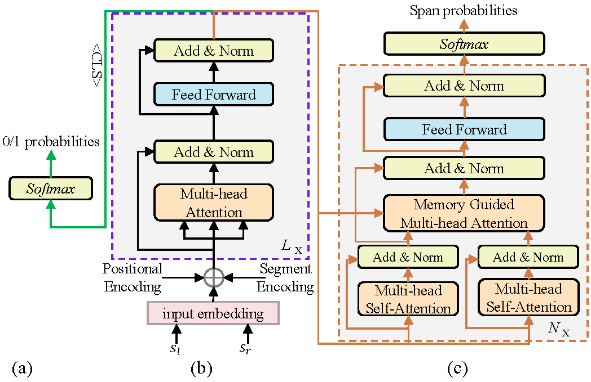

# RobustMRC
Source code of paper "An Understanding-Oriented Robust Machine Reading Comprehension Model". The paper has been accepted by ACM Transactions on Asian and Low-Resource Language Information Processing.

## Introduction
Although existing machine reading comprehension models are making rapid progress on many datasets, they are far from robust. In this paper, we propose an understanding-oriented machine reading comprehension model to address three kinds of robustness issues, which are over sensitivity, over stability and generalization. Specifically, we first use a natural language inference module to help the model understand the accurate semantic meanings of input questions so as to address the issues of over sensitivity and over stability. Then in the machine reading comprehension module, we propose a memory-guided multi-head attention method that can further well understand the semantic meanings of input questions and passages. Third, we propose a multi-language learning mechanism to address the issue of generalization. Finally, these modules are integrated with a multi-task learning based method. We evaluate our model on three benchmark datasets that are designed to measure models' robustness, including DuReader (robust) and two SQuAD-related datasets. Extensive experiments show that our model can well address the mentioned three kinds of robustness issues. And it achieves much better results than the compared state-of-the-art models on all these datasets under different evaluation metrics, even under some extreme and unfair evaluations.
## Environments
* python 3.6.9

* transformers 4.17.0

* tensorflow-gpu 1.13.2
## Dataset

The format of the dataset used by the code is similar to squad. The difference is that there are two more keys in training set, "type" and "label", in the "answers" to indicate the task type (mrc or nli).

When type is qa, it is mrc sample, which is no different from the normal mrc sample.

When the type is nli, it is nli sample, the context and the text in the answers form a sentence pair, and "label" is the label, as shown below. "answers/answer_start" and "answers/test" are useless.
```
{
    "context": "What is the step by step guide to invest in share market in india?",
    "qas": [
        {
            "answers": [
                {
                    "answer_start": 0,
                    "text": "What",
                    "type": "nli",
                    "label": "0"
                }
            ],
            "question": "What is the step by step guide to invest in share market?",
            "id": "0"
        }
    ]
}
```
## Run 
* Stage 0 set pre-trained model and dataset path.

    Pre-trained model should be a bert-like model. It can be downloaded from <https://github.com/google-research/bert>
    ```
    export BERT_PATH=pre_model/multi_cased_L-12_H-768_A-12
    export DATA_PATH=dataset
    ```
* Stage 1 preprocess 
    ```
    python run_squad_nli.py \
    --vocab_file=$BERT_PATH/vocab.txt \
    --bert_config_file=$BERT_PATH/bert_config.json \
    --init_checkpoint=$BERT_PATH/bert_model.ckpt \
    --do_prepro=True \
    --train_file=$DATA_PATH/train.json \
    --eval_file=$DATA_PATH/dev.json \
    --predict_file=$DATA_PATH/dev.json \
    --do_lower_case=False \
    --train_batch_size=12 \
    --learning_rate=3e-5 \
    --num_train_epochs=2.0 \
    --max_seq_length=512 \
    --max_query_length=64 \
    --doc_stride=128 \
    --output_dir=output/
    ```
* Stage 2 train
    ```
    python run_squad_nli.py \
    --vocab_file=$BERT_PATH/vocab.txt \
    --bert_config_file=$BERT_PATH/bert_config.json \
    --init_checkpoint=$BERT_PATH/bert_model.ckpt \
    --gpu 1 \
    --do_train=True \
    --train_file=$DATA_PATH/train.json \
    --eval_file=$DATA_PATH/dev.json \
    --predict_file=$DATA_PATH/dev.json \
    --do_lower_case=False \
    --train_batch_size=8 \
    --learning_rate=3e-5 \
    --num_train_epochs=1.0 \
    --max_seq_length=512 \
    --max_query_length=64 \
    --max_answer_length=40 \
    --doc_stride=128 \
    --output_dir=output/
    ```
* Stage 3 predict
    ```
    python run_squad_nli.py \
    --vocab_file=$BERT_PATH \
    --bert_config_file=$BERT_PATH/bert_config.json \
    --init_checkpoint=$BERT_PATH/bert_model.ckpt \
    --do_predict=True \
    --predict_file=dataset/dev.json \
    --do_lower_case=False \
    --train_batch_size=8 \
    --learning_rate=3e-5 \
    --num_train_epochs=3.0 \
    --max_seq_length=512 \
    --max_query_length=64 \
    --max_answer_length=40 \
    --doc_stride=128 \
    --output_dir=output/ 
    ```
* Stage 4 eval
    ```
    python eval_squad.py dataset/dev.json output/predictions.json
    ```

